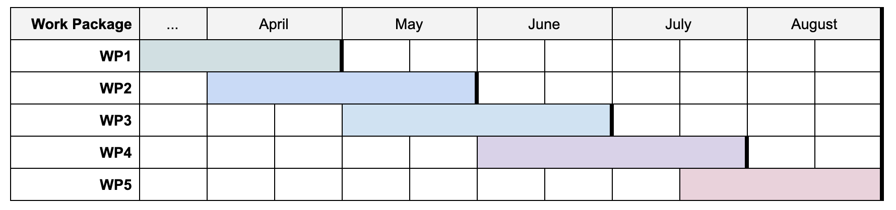

# Work Plan SwissMADE 2021

* Timeframe: 1.4 and 31.8.

## Work Packages

* **WP1**: transfer of structured and unstructured data from USZ to Lausanne. This hopefully can be done in the next week, even, given that Lausanne has revised the necessary documents.
* **WP2**: fixing encoding errors in the unstructured data from USZ and possibly KSB. This is not strictly necessary, but in the USZ data, some umlauts are not encoded correctly, which could tip off the pipeline and make comparison to other data sets difficult. Since the encording does not seem to be consistent, this is not quite as simple as it sounds. 
  As for KSB data, please keep me in the loop about the format and so forth so I can offer to help if it makes sense.
* **WP3**: running the UZH pipeline on the KSB data, and creating annotation samples according to the same rules as for the USZ data. The main obstacle is access to the data; ideally I can get a remote access to the data that is stored already in Lausanne.
* **WP4**: evaluation of the UZH pipeline using the manual annotations from KSB; possibly with the extension of evaluation also performance of our approach on KSB data.
* **WP5**: summarizing the results and lessons learned from the project, which we have already previously already discussed, either to share with other partners or to use as the basis for a follow-up project.

## Roadmap

In the roadmap below I listed how long I estimate each WP to take and in which order I would suggest to proceed.

